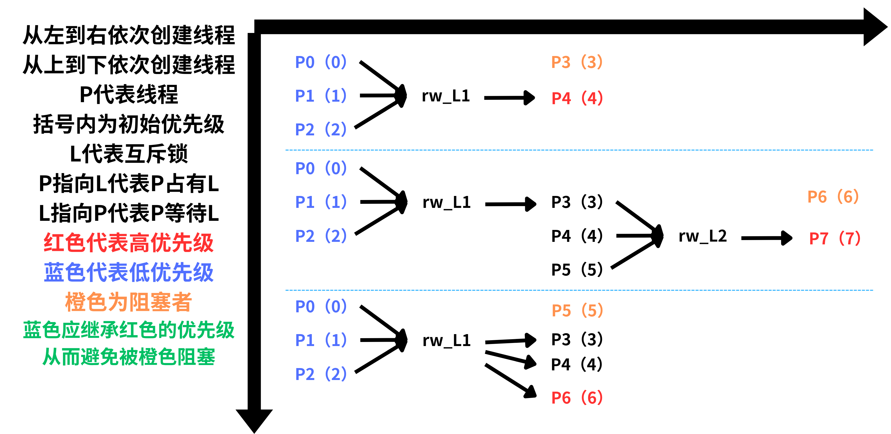

# 测试设计

## 一、测试形式

测试程序是shell脚本程序test.sh。运行前需编译、更换内核。其运行时，依次将三个子测试程序以模块的形式加载进内核。对于每一个子测试程序来说，主体是模块的初始化函数，脚本在等待10秒（确保初始化函数运行完毕）后，卸载测试模块，然后读取内核日志进行**分析和可视化输出**。

简单起见，在测试程序中我们会指定线程在某些CPU上运行。

## 二、通用测试原理

不管对于互斥锁还是信号量，在对其优先级继承实现的测试上，原理是相通的，在此进行介绍。测试分四部分。

1. **是否能解决简单的翻转问题**
    
    低中高三个线程，低占有锁，高等待锁，而中抢占低。测试的关键是看低能不能抢占中。以及低释放锁后能否被中抢占。

2. **是否维护了优先级继承链**

    多个线程多个锁，测试优先级能否通过链进行传递。具体见下文中的图。

3. **是否能维护等待者队列**

    测试某个锁或者信号量在拥有多个等待者时，能否动态地选取其中的最高优先级作为自己拥有者的优先级。

4. **时延测试**

    记录高优先级线程从试图获取锁到实际取得锁之间的时间，用于比较我们编写的锁和原生锁的实时性。

## 三、具体测试

### 1. 互斥锁测试

### 2. 读写锁和读写信号量测试

因为在逻辑上，读写信号量和读写锁的功能是一样的，所以设计方案相同。

读写锁和互斥锁的区别在于共享资源的“占有者”的数量。一个被读写锁保护的共享变量，其占有者如果只是一个写进程，那么情况和互斥锁无异，但如果其占有者是若干读进程，那么每个读进程都应被“提级”。不妨把高优先级线程设定为试图写的进程。

