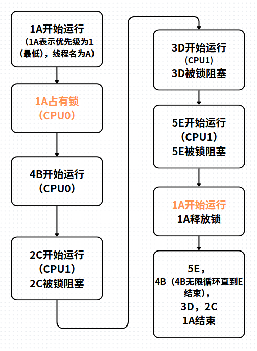
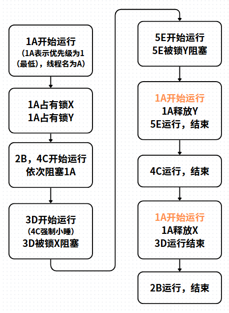

# 0. 总体测试设计

我们的测试程序以模块的形式加载进内核，大约几秒后，测试线程运行完毕，卸载测试模块，然后用dmesg就能查看日志。简单起见，所有测试线程只能使用同一个CPU。

# 1. 优先级翻转测试
| 缩写 | 含义 |
| :----: | :----: |
| L | 低优先级线程 |
| M | 中优先级线程 |
| H | 高优先级线程 |
 * * *
优先级翻转要解决的问题是：H因为锁被L阻塞，而L会被M阻塞，所以看起来M阻塞了H。 

关键测试点：
- 在H由于锁被阻塞后，L立马抢占了M。
- 在L释放锁后，L恢复到最低优先级，L的剩余代码最后执行。

测试设计要点：
- 确保H出现时锁已被L占有。
- 避免任何线程提前结束，即运行完毕。
- 尽量准确地获取H试图获取锁和得到锁的两个时间点的时间。

# 2. 优先级继承测试

优先级继承要解决的问题是：若干线程在等待同一个锁，锁应取其中的最高优先级为拥有者的优先级。每当有线程和锁的关系发生了变化，锁都需要调整拥有者的优先级。测试流程：

由橙色标记，1A得到了5E的优先级，从而在4B结束前得到运行。

# 3. 优先级合并测试

优先级合并要解决的问题是：线程X持有若干锁，线程应取其中的最高优先级为自己的优先级。每当有线程和锁的关系发生了变化，X都需要调整自己的优先级。

核心测试点：
- 线程取持有的锁中优先级最高的。第一处橙色标记证明这一点，此时4C还未结束，1A能运行说明得到了5E的优先级。
- 线程要保留其他锁的优先级，在释放最高优先级的锁后，不能直接恢复到初始优先级。第二处橙色标记证明这一点，此时2B还未结束，1A能运行说明保留了3D的优先级。
