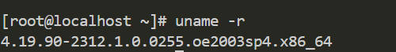

# 内核编译及安装
### 查看当前内核版本

为OE官方发布的内核，这里需要替换成linux标准内核
### 下载相关包
`yum install -y gcc gcc-c++ make cmake unzip zlib-devel libffi-devel openssl-devel pciutils net-tools sqlite-devel lapack-devel openblas-devel gcc-gfortran ncurses-devel bison m4 flex bc`
`sudo dnf install elfutils-libelf-devel ncurses-devel openssl-devel bc flex bison perl wget git gcc make dracut`
### 解压内核文件
`tar -xvf linux-4.19.325.tar.xz`对内核文件进行解压。
### 配置编译选项
进入解压后的目录，输入`make menuconfig`进行编译配置
此处先不进行配置，仅保留默认选项进行第一次编译，在第一次编译时请跳过该步

```
#### 配置项解析

##### 开启锁支持的选项

路径:`General setup` → `Preemption Model`

- `Preemption Model (Fully Preemptible Kernel (RT))`
  如果需要测试 `rtmutex` 及实时优先级调度，这个必须启用。但 vanilla 4.19.325 并不原生支持 RT（需要打 patch）。

- `Preemptible Kernel (Low-Latency Desktop)`
  支持更细粒度的抢占，利于模拟高优先级抢占测试。

- 若打算使用`rtmutex`进行测试，需要打 PREEMPT-RT 补丁。
  `Patch: patch-4.19.325-rtXXX.patch.gz`（XXX为rt补丁版本号）
  打补丁后重新配置内核并启用：
  `CONFIG_PREEMPT_RT_FULL=y`
  `CONFIG_RT_MUTEXES=y`（内核自动开启）

##### 默认开启但需确认未被裁剪的选项

路径：`Kernel hacking` → `Lock Debugging`

- ✅ 推荐启用：
  `CONFIG_DEBUG_SPINLOCK=y`
  `CONFIG_DEBUG_RWSEMS=y`
  `CONFIG_DEBUG_MUTEXES=y`
  这些选项用于观察和调试读写锁、互斥锁（mutex）及 rtmutex 的行为。

##### 性能计数和追踪支持

路径：`Kernel hacking ` →`Performance monitoring`

- ✅ 推荐启用：
  `CONFIG_PERF_EVENTS=y`
  打开性能事件支持，用于 perf 工具测试
  `CONFIG_TRACE_IRQFLAGS=y`
  跟踪中断开关行为
  `CONFIG_LOCKDEP=y`

锁依赖链分析
路径：`General setup` → `Kernel Performance Events And Counters
`

##### 调度类与优先级范围支持

- 确保以下设置打开：
  `CONFIG_SCHEDSTATS=y`
  调度统计数据，分析优先级切换情况
  `CONFIG_SCHED_DEBUG=y`
  导出调度器内核参数到 `/proc/sched_debug`

##### 调试用的 sysrq 与 Magic SysRq

建议启用以便于调试：
路径：`Kernel hacking` → `Magic SysRq key`
`CONFIG_MAGIC_SYSRQ=y`

#### 测试工具建议

使用 `perf`, `ftrace`, `lockstat`, `latencytop` 等工具
使用 `cyclictest`（特别是在 RT 补丁环境）评估调度延迟
使用自定义的压力测试程序反复测试 `rwlock/mutex/rtmutex`
```

#### 编译内核并构建
```
make -j$(nproc) && make modules_install && make install
update-grub  # 如果使用 grub
reboot
```

 报错
`Cannot generate ORC metadata for CONFIG_UNWINDER_ORC=y, please install libelf-dev, libelf-devel or elfutils-libelf-devel`
解决
`sudo yum install elfutils-libelf-devel`
报错

```
Error! Bad return status for module build on kernel: 4.19.325 (x86_64)
Consult /var/lib/dkms/kmod-kvdo/6.2.2.24-10/build/make.log for more information
```
这是 DKMS（动态内核模块支持）尝试为 kmod-kvdo 构建模块失败 所导致的错误，它 不会影响你正常安装和使用编译后的内核本身，但为了保持系统干净或避免未来警告，你可以按以下方法处理
解决
卸载kvdo
`sudo dnf remove kmod-kvdo kvdo`
##### 生成 initramfs 文件
`sudo dracut -f /boot/initramfs-4.19.325.img 4.19.325`
##### 更新grub引导项
`sudo grub2-mkconfig -o /boot/grub2/grub.cfg`
##### 重启虚拟机并验证
`sudo reboot`
`uname -r`

**TODO**
- [x] 下载内核镜像
- [x] 配置选项
- [ ] 安装补丁
- [ ] 编译内核并安装

