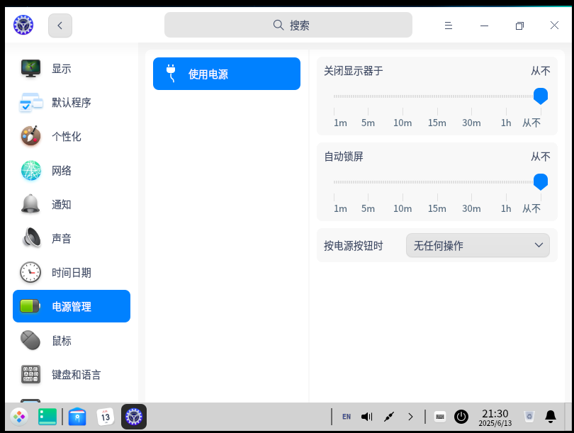
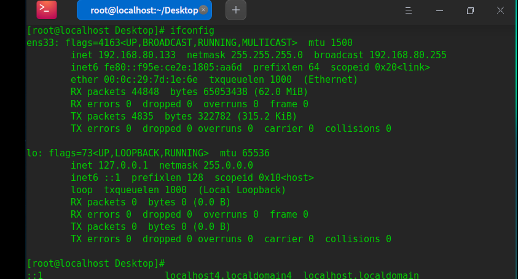
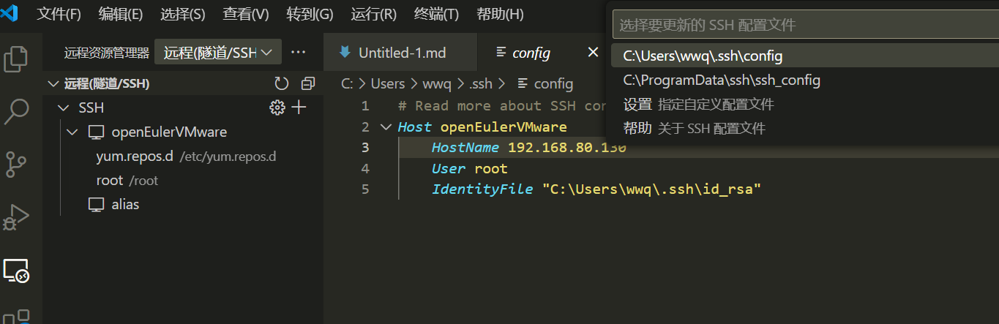
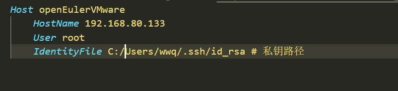

# 基于Vmware Workstation 17.5及openEuler 20.04 SP4的环境配置

## 1.ISO镜像文件下载
在官网下载openEuler 20.04 SP4的镜像文件
https://www.openeuler.openatom.cn/zh/download/archive/detail/?version=openEuler%2020.03%20LTS%20SP4
本文选取Standard版本进行安装
## 2.安装
安装链接参考这篇博客
https://blog.csdn.net/2302_82189125/article/details/137759482
注意选择linux版本建议选为 其他linux版本 4.x内核版本

## 3.配置网卡
#### 问题
在完成安装后使用yum指令进行相关的软件包下载，会提示无法解析域名
#### 问题分析
尝试`ping 8.8.8.8`，失败 网络未正常连接
#### 修复
关闭虚拟机，在vmware的虚拟机设置中确认虚拟机的相关设置是否正确

确定为NAT链接，且启动时链接选项被勾选。
在终端输入指令 `ip link show`
终端回显
`2: ens33: <BROADCAST,MULTICAST> mtu 1500 qdisc noop state DOWN mode DEFAULT group default qlen 1000`
可以看到state为DOWN，若你的不是，跳过这步
终端输入指令`sudo ip link set ens33 up`来打开网卡
使用`ip a`查看是否分配到ip
在网卡下如ens33下是否有`inet xxx.xxx.xxx.xxx`的ip显示
若没有，则需要启用DHCP，输入`sudo dhclient ens33`。
再次进行ping测试，若成功则修复完成
#### **（可选）** 开启DHCP服务自动获取ip
openEuler使用NetWorkManager管理网络
使用`nmcli connection show`查看连接配置
使用`nmcli connection modify "Wired connection 1" connection.autoconnect yes`开启该连接的自动连接
使用`nmcli connection up "Wired connection 1"`启用网络连接
## 4.安装图形界面
此处安装DDE桌面环境
`yum install dde`
设置以图形化方式启动系统
`systemctl set-default graphical.target`
重启系统
`reboot`
## 5.修改电源计划
编译内核需要的时间一般较久，建议修改此处为 

## 6.配置VSCODE ssh远程连接
在虚拟机的终端中输入指令`ifconfig`，若没有请安装`net-tools`软件包
记录网卡的ip地址，即虚拟机的ip

在虚拟机上安装ssh服务`yum install openssh-server`。
打开`/etc/ssh/sshd_config`
去掉这两条的注释
```
#Port 22
···
#PubkeyAuthentication
```
重新启动ssh服务
`systemctl restart sshd`

在主机的powershell中尝试用`ssh "username"@ipaddress`连接到虚拟机，出现以下终端画面表示成功

### 配置VSCODE
下载remote ssh插件，已下载则跳过，在远程连接选项中打开ssh的配置文件

修改hostname，此处identifyfile先不填，在下一步配置ssh密钥中再添加
#### 报错

#### 解决
`vim /etc/ssh/sshd_config`
去掉注释
```
#AllowTcpForwarding yes
```
重启ssh服务
`systemctl restart sshd`
报错解决
### 连接VSCODE
出现如下画面，即右上角出现install时，连接成功，点击加号打开新终端

出现如下图片连接成功

### 配置免密登录
在windows的powershell中输入`ssh -keygen -t rsa`,之后一路回车，生成密钥

完成后将该目录下的`id_rsa.pub`中的内容复制到虚拟机的/root/.ssh目录下，建议在vscode的终端中进行该步骤操作，可直接复制。

加入私钥路径
配置完成
#### TODO
- [x] 配置基础环境
- [ ] 编译内核
- [ ] 尝试加入rt_mutex模块