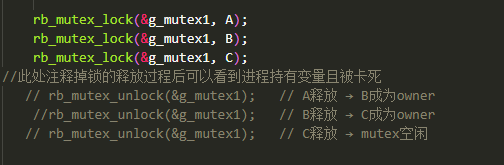
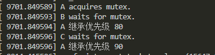
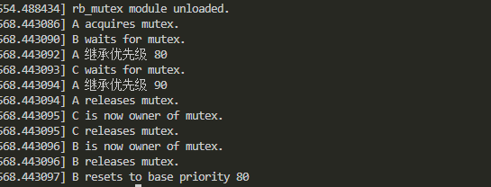

# 6.20工作日志

## 当前进展
- [x] 完成了对于上一届优秀作品的研究
- [x] 以模块化的方式对于优先级继承链锁进行了测试
- [ ] 进一步丰富代码，将模拟的demo落实为功能
## 主要结构
| 组件                   | 功能                                        |
| -------------------- | ----------------------------------------- |
| `rb_mutex`           | 自定义互斥锁结构，支持红黑树排序的等待队列    |
| `task_node`          | 模拟任务结构体，具有当前/基础优先级与任务名    |
| 红黑树（rbtree）          | 用于对等待该锁的任务按优先级排序，支持 `rb_insert_color` 等操作 |
| `/proc/rb_mutex`     | 提供对当前锁状态（owner + 等待队列）的可读视图     |
| `propagate_priority` | 实现链式优先级继承逻辑     |
## 核心功能
### 优先链的传递
函数` propagate_priority() `实现递归：

构成优先级传递链
`C(90)` → 等待 `mutex` ← `B(80)` ← 等待`mutex` ← `A(60)`
最终 A 的 `curr_prio` 被提升到 90
由等待者触发该函数，随后将自己的优先级向上传递
### 红黑树维护等待队列
`rb_mutex_enqueue()` 保证插入排序，使高优先级任务靠左，即红黑树中左侧节点为更高优先级。
这使得 `rb_mutex_top_waiter() `能直接返回最高优先级等待者（左子树最小节点）。
### /proc接口
```
cat /proc/rb_mutex
```
输出当前锁持有者与等待队列。用于验证链式继承、红黑树插入、任务状态等。
## 场景模拟
设计三个任务，其优先级与互斥锁持有关系如下
|任务名|优先级|互斥锁需求|
|------|:-----:|-------|
|TASK A| 60|持有mutex1 |
|TASK B|80| 需要mutex1 |
|TASK C|90|需要mutex1 | 

目前这三个任务局限于init函数中模拟的进程，并没有实际的代码和作用，需要后续进行填充
## 模块使用步骤
- `make clean`指令删除上一次编译的残留文件
- `make`指令编译模块生成.ko文件
- `rmmod rb_mutex`指令卸载旧模块
- `insmod rb_mutex.ko`加载新模块
- `cat /proc/rb_mutex`查看当前优先级传递情况
- `dmesg |tail -n 30`查看日志
## 优先级传递链测试
1. 注释程序中的释放锁的代码，使优先级传递过程卡死在其中一步。
    
2. 编译运行模块，查看当前锁的持有者与他的优先级
    
    任务A未释放mutex，但A已成功继承C的90优先级
3.  打印日志如下
    

4. 解除对锁的占有，使得每个人物能够顺利释放互斥锁，打印日志如下
   