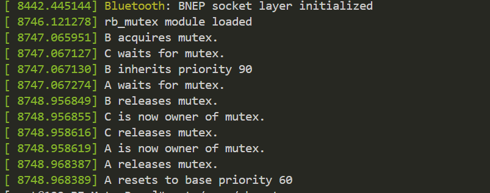

# 6.23工作日志
## 1.多个锁实例的实现
现在可以同时创建多个mutex锁，锁与锁之间通过链表的数据结构方式进行管理
创建锁的指令为
```
echo create > /proc/rb_mutex_ctrl
```
在全局列表`list_head mutex_list`中，存储线程分配的`mutex`变量，通过`rb_mutex_proc_write()`接受创建锁的指令，通过`kmalloc`创建链表新成员再将其挂入全局列表中。
查看锁状态`cat /proc/rb_mutex`

## 2. 引入kthread
引入kthread动态创建真实线程，用真实线程对继承和调度过程进行还原。
kthread的运行逻辑为
```
1. 延迟启动（sleep 1s）
2. 请求锁（rb_mutex_lock）
3. 持锁运行（sleep 1s）
4. 解锁（rb_mutex_unlock）
```
用该方法成功仿真了实际任务中锁的创建与释放流程。

内核线程ABC完成了锁的搭建与释放
## 3. 加入优先级回复机制
即当某个锁被释放时，检查现在的任务队列，如果该锁已没有等待者，进行优先级恢复，当锁存在等待者时不立即进行恢复
当一个进程同时持有多个锁时，将通过链表的方式对锁进行存储
```
struct list_head held_mutexes;
```
运用该数据结构进行锁的存储，当释放一个mutex时，通过`reset_priority()`遍历式的检查剩余的mutex，所使用的时间复杂度为O(n)
mutex释放步骤
```
list_del(&mutex->held_entry);
reset_priority(task);
```
### 测试
继承测试
```
[root@192 PI_MutexRepo]# echo "create dummy 0" > /proc/rb_mutex_ctrl
[root@192 PI_MutexRepo]# echo "create dummy 0" > /proc/rb_mutex_ctrl
[root@192 PI_MutexRepo]# cat /proc/rb_mutex

Mutex #0:
  Owner: None (prio=-1)
  Waiters:

Mutex #1:
  Owner: None (prio=-1)
  Waiters:
[root@192 PI_MutexRepo]# echo "lock B 0" > /proc/rb_mutex_ctrl
[root@192 PI_MutexRepo]# cat /proc/rb_mutex

Mutex #0:
  Owner: B (prio=80)
  Waiters:

Mutex #1:
  Owner: None (prio=-1)
  Waiters:
[root@192 PI_MutexRepo]# echo "lock C 0" > /proc/rb_mutex_ctrl
[root@192 PI_MutexRepo]# cat /proc/rb_mutex

Mutex #0:
  Owner: B (prio=90)
  Waiters:
   - C (curr_prio=90, base_prio=90)

Mutex #1:
  Owner: None (prio=-1)
  Waiters:
[root@192 PI_MutexRepo]# echo "lock A 1" > /proc/rb_mutex_ctrl
[root@192 PI_MutexRepo]# cat /proc/rb_mutex

Mutex #0:
  Owner: B (prio=90)
  Waiters:
   - C (curr_prio=90, base_prio=90)

Mutex #1:
  Owner: A (prio=60)
  Waiters:
[root@192 PI_MutexRepo]# echo "lock B 1" > /proc/rb_mutex_ctrl
[root@192 PI_MutexRepo]# cat /proc/rb_mutex

Mutex #0:
  Owner: B (prio=90)
  Waiters:
   - C (curr_prio=90, base_prio=90)

Mutex #1:
  Owner: A (prio=90)
  Waiters:
   - B (curr_prio=90, base_prio=80)
```
恢复测试
```
[root@localhost PI_MutexRepo]# cat /proc/rb_mutex_tasks
Tasks:
 - A (curr_prio=90, base_prio=60)
 - B (curr_prio=90, base_prio=80)
 - C (curr_prio=90, base_prio=90)
[root@localhost PI_MutexRepo]# echo "unlock A 1" > /proc/rb_mutex_ctrl
[root@localhost PI_MutexRepo]# cat /proc/rb_mutex

Mutex #0:
  Owner: B (prio=90)
  Waiters:
   - C (curr_prio=90, base_prio=90)

Mutex #1:
  Owner: B (prio=90)
  Waiters:
[root@localhost PI_MutexRepo]# echo "unlock B 0" > /proc/rb_mutex_ctrl
[root@localhost PI_MutexRepo]# cat /proc/rb_mutex

Mutex #0:
  Owner: C (prio=90)
  Waiters:

Mutex #1:
  Owner: B (prio=90)
  Waiters:
[root@localhost PI_MutexRepo]# echo "unlock B 1" > /proc/rb_mutex_ctrl
[root@localhost PI_MutexRepo]# cat /proc/rb_mutex

Mutex #0:
  Owner: C (prio=90)
  Waiters:

Mutex #1:
  Owner: None (prio=-1)
  Waiters:
[root@localhost PI_MutexRepo]# cat /proc/rb_mutex_tasks
Tasks:
 - A (curr_prio=90, base_prio=60)
 - B (curr_prio=80, base_prio=80)
 - C (curr_prio=90, base_prio=90)
 ```
 ## 4.加入了动态创建任务的机制
 修改了proc显示任务的函数，并增加了对任务动态生成的支持
 ```
 [root@localhost PI_MutexRepo]# echo "T1 75" > /proc/rb_mutex_task_ctrl
[root@localhost PI_MutexRepo]# cat /proc/rb_mutex_tasks
Task A: base_prio=60, curr_prio=60
Task B: base_prio=80, curr_prio=80
Task C: base_prio=90, curr_prio=90
Task T1: base_prio=75, curr_prio=75
[root@localhost PI_MutexRepo]# 
 ```
## 5.优化任务查找
由静态改编为全局查找

## 当前版本支持的指令集
`cat /proc/rb_mutex`
查看当前的mutex列表，并列出每个mutex的等待者队列和当前持有者
`cat /proc/rb_mutex_tasks`
查看当前的task列表，给出当前优先级和基础优先级
`echo "create dummy 0" > /proc/rb_mutex_ctrl`
创建一个mutex锁,锁的编号依次向后
`echo "lock B 0" > /proc/rb_mutex_ctrl`
对某个任务上锁，B表示任务名，0表示mutex编号
`echo "unlock B 1" > /proc/rb_mutex_ctrl`
解锁某个任务，B表示任务名，1表示mutex编号
 `echo "T1 75" > /proc/rb_mutex_task_ctrl`
 动态生成任务，T1表示任务名，75表示优先级